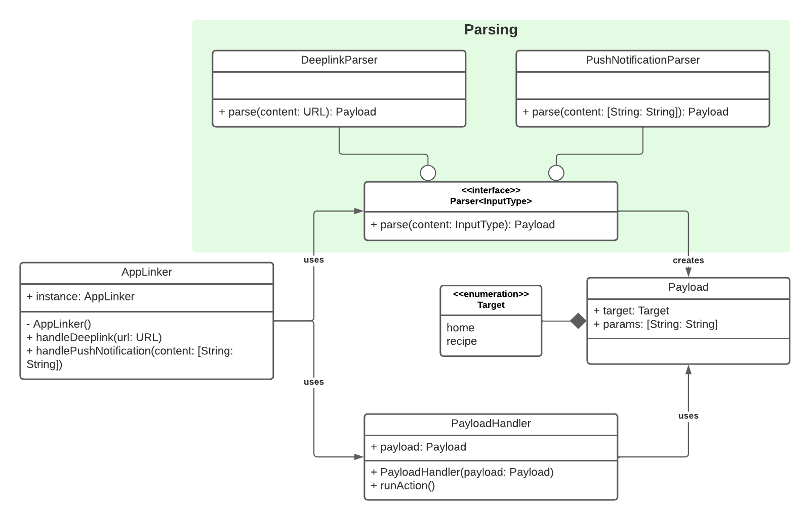

# Organizing your app to handle deeplinks and push notifications

This article presents a way to organize in a same module the code for handling deeplinks and the one for handling push notifications. The code that is presented is written in Swift and for iOS but the architecture of the module and the logic of the code can be transposed to other languages and plateforms.

The code is available at https://github.com/antoine-cottineau/app_linker.

## Table of contents

1. Deeplinks and push notifications
2. A simple example
3. The module
4. Conclusion

## 1. Deeplinks and push notifications

Before diving into how the module is structured, let's briefly describe what deeplinks and push notifications are.

A deeplink is a special kind of link that, when opened in a browser of a mobile phone, opens a specific screen of a native application. For example, for a company that provides a website and an application dedicated to weather forecasts, a deeplink could be used to open the screen of the app that shows the weather forecast for a specific day. If the user doesn't have the app installed or isn't on mobile, then the corresponding webpage can be opened in the browser. On iOS, deeplinks are called [universal links](https://developer.apple.com/ios/universal-links/) but we'll keep the term deeplink because it is more general.

A push notification is a piece of data that can be sent from a backend to a mobile device. It often provide information to the user and can also encourage them to perform an action. For example, a football app may send push notifications to its users whenever a goal is scored in a match. By tapping on the push notification, the user would expect the app to open the screen that shows the match.

Both deeplinks and push notifications are a good way to enrich an app. As the action performed when opening a deeplink or when tapping a push notification is often the same, it makes sense to create a single module for handling both structures.

## 2. A simple example

To keep the implementation concrete, we chose to design the module for a fictional recipe app called `bestrecipes`. This app could for example contain recipes that are posted by chefs, a way for the user to follow chefs, a grading system for the recipes...

We'll focus on implementing deeplinks and push notifications that can either link to a homefeed or to a "recipes" screen. Here are some examples of possible deeplinks and push notifications:

### Home

Deeplink: `https://bestrecipes.com/home`

Push notification:
```json
{"type": "home"}
```

### Recipe by id

Deeplink: `https://bestrecipes.com/recipe?id=1234`

Push notification:
```json
{"type": "recipe", "id": "1234"}
```

### Recipes by country and with a limit
Deeplink: `https://bestrecipes.com/recipe?country=FR&limit=7`

Push notification:
```json
{"type": "recipe", "country": "FR", "limit": 7}
```


## 3. The module

The following picture is a UML class diagram of the module:



Even if the diagram can make the module appear complex, the logic behind how the module isn't complicated. We'll study various parts of the module in the following sections.

### 3.1 Models

We use two simple models to represent respectively deeplinks and push notifications:

```swift
// PushNotification.swift
struct PushNotification {
    let type: LinkType
    let parameters: [String: String]
}
```

```swift
// Deeplink.swift
struct Deeplink {
    let type: LinkType
    let parameters: [String: String]
    let url: URL
}
```

As you can see, the two models have a `type` field of type `LinkType`. `LinkType` is just an enumeration that lists the possible types of deeplinks/push notifications:

```swift
// LinkType.swift
enum LinkType: String {
    case home
    case recipe
}
```

### 3.2 LinkTarget and adapters

`LinkTarget` is a protocol that represents a possible destination of a deeplink or a push notification. Two classes implement `LinkTarget`: `HomeLinkTarget` and `RecipeLinkTarget`.

```swift
// LinkTarget.swift
protocol LinkTarget {
    /// The type of the link.
    static var type: LinkType { get }

    /// A failable initializer that constructs the instance if the inputted deeplink corresponds to the target.
    /// Otherwise, it returns nil.
    init?(deeplink: Deeplink)

    /// A failable initializer that constructs the instance if the inputted push notification corresponds to the target.
    /// Otherwise, it returns nil.
    init?(pushNotification: PushNotification)
}
```

A class implementing `LinkTarget` should possess two failable initializers that constructs an instance if and only if the inputted deeplink or push notification possesses enough information. For example, here is how one of the initializer or `RecipeLinkTarget` is implemented:

```swift
// RecipeLinkTarget.swift
class RecipeLinkTarget: LinkTarget {
    static var type: LinkType = .recipe

    private let id: String?
    private let country: String?
    private let limit: Int?

    required init?(deeplink: Deeplink) {
        id = deeplink.parameters["id"]
        country = deeplink.parameters["country"]
        if let limitValue = deeplink.parameters["limit"] {
            limit = Int(limitValue)
        } else {
            limit = nil
        }
    }
}
```

In this example, each field is nullable. However, if a field is mandatory for a specific link and it is missing from the deeplink/push notification, then the initializer should return nil.

These two initializers take a `Deeplink` or `PushNotification` for input. However, when receiving a deeplink or a push notification, the app would only receive a string that needs to be converted to one of the models. That's the role of adapters:

```swift
// Adapter.swift
protocol Adapter {
    /// Parse the provided content and returns a Target if the parsing was possible.
    /// - Returns: An instance of Target.
    func adapt<Target: LinkTarget>(content: Any) -> Target?
}
```

The only goal of the function `adapt` is to create a `LinkTarget` with the inputted content. For example, here is how the `DeeplinkAdapter` does it:

```swift
// DeeplinkAdapter.swift
class DeeplinkAdapter: Adapter {
    func adapt<Target: LinkTarget>(content: Any) -> Target? {
        guard let urlString = content as? String,
              let url = URL(string: urlString),
              let type = LinkType(rawValue: url.pathComponents[1]),
              type == Target.type
        else {
            return nil
        }

        var parameters = [String: String]()
        URLComponents(url: url, resolvingAgainstBaseURL: false)?.queryItems?.forEach { queryItem in
            parameters[queryItem.name] = queryItem.value
        }

        let deeplink = Deeplink(type: type, parameters: parameters, url: url)

        return Target(deeplink: deeplink)
    }
}
```

The `DeeplinkAdapter` tries to extract the `LinkType` that corresponds to the inputted content. If this type is the expected one, then an instance of `TargetLink` is created.

### 3.3 Putting things together

Up to this point, it is possible to parse an incoming deeplink or push notification and to create a corresponding `LinkTarget`. However, there is still no code for describing what action should be made when the user opens a deeplink or tap on a push notification. For example, if the user taps on a push notification saying "Discover the last recipe by Chef Martin", it would be expected that the screen corresponding to the recipe would open.

To encapsulate such actions, we create the interface `Link` and a class implementing it: `AppLink`:

```swift
// Link.swift
protocol Link {
    /// Get whether or not the content can be handled by this link.
    /// - Returns: Whether or not the content can be handled by this link.
    func canLink(content: Any) -> Bool

    /// Perform an action that corresponds to the inputted content.
    func performAction(content: Any)
}
```

```swift
// Link.swift
class AppLink<Target: LinkTarget>: Link {
    /// The action that the link performs.
    private let action: (Target) -> Void

    init(action: @escaping (Target) -> Void) {
        self.action = action
    }

    func canLink(content: Any) -> Bool {
        let adapterResults: [Target?] = [DeeplinkAdapter().adapt(content: content), PushNotificationAdapter().adapt(content: content)]
        return !adapterResults.compactMap { $0 }.isEmpty
    }

    func performAction(content: Any) {
        let adapterResults: [Target?] = [DeeplinkAdapter().adapt(content: content), PushNotificationAdapter().adapt(content: content)]
        if let target = adapterResults.compactMap({ $0 }).first {
            action(target)
        }
    }
}
```

These two structures help abstract what is a deeplink and a push notification: a link should be able to parse some content and perform an action.

We then need to add a way to create `AppLink`. A possible way to do so would be to create a factory whose responsability would be to create one link for each possible `LinkType`.

For simplicity reasons, we chose to perform the link creation in the `LinkTarget` classes by adding a new function to the protocol:

```swift
// LinkTarget.swift
protocol LinkTarget {
    // Other functions...

    /// A method used to create a link for this target.
    /// - Returns: An instance of a class implementing Link.
    static func createLink() -> Link
}
```

As an example, here is how a link is created in `HomeLinkTarget`:

```swift
// RecipeLinkTarget.swift
class RecipeLinkTarget: LinkTarget {
    // Fields and initializers...

    // Create a Link for everything that is related to recipes
    static func createLink() -> Link {
        return AppLink<Self> { target in
            // Use the parameters of target to present some recipes
            var action = "recipe"
            if let id = target.id {
                action += " id=\(id)"
            }
            if let country = target.country {
                action += " country=\(country)"
            }
            if let limit = target.limit {
                action += " limit=\(limit)"
            }
            print(action)
        }
    }
}
```

The function use the provided instance of `RecipeLinkTarget` to define the action to perform. In a real app, a screen showing one or several recipes could be displayed, depending on the values of `id`, `country` and `limit`.

We still have to create one last thing: an entry point to the module:

```swift
// AppLinker.swift
public class AppLinker {
    public static var instance = AppLinker()

    /// The list of links that should be matched against the content that is received by the AppLinker.
    private let links: [Link] = [HomeLinkTarget.createLink(), RecipeLinkTarget.createLink()]

    /// Try to parse the content and trigger the corresponding action.
    /// The method tries to parse the content as one of the registered links and, if the parsing is successful, the link's action is triggered.
    /// - Parameter content: The content that should be parsed. It can either be a url (deeplink) or a dictionary of strings/strings (push notification).
    public func handle(content: Any) {
        let matchedLink = links.first { $0.canLink(content: content) }
        matchedLink?.performAction(content: content)
    }
}
```

The `AppLinker` is a public singleton that can be accessed from anywhere in the app. It stores a list of links and whenever some content is received, we test if one of the links can handle it. If so, we perform the action of the corresponding link.

## 4. Conclusion

The goal of this article was to provide a possible way to architecture a single module for handling both deeplinks and push notifications. There is certainly room for improvement but the code that is presented should constitute a solid start.

To receive the content of a deeplink or a push notification, it is necessary, in iOS, to overwrite functions in the `AppDelegate` or the `SceneDelegate` depending on what you're using. See this documentation for more information: [AppDelegate](https://developer.apple.com/documentation/uikit/uiapplicationdelegate)/[SceneDelegate](https://developer.apple.com/documentation/uikit/uiscenedelegate).

Finally, I would like to thank David Rico (LINK TO DAVID'S PAGE). We both worked on the module and I learnt a lot by working with him.